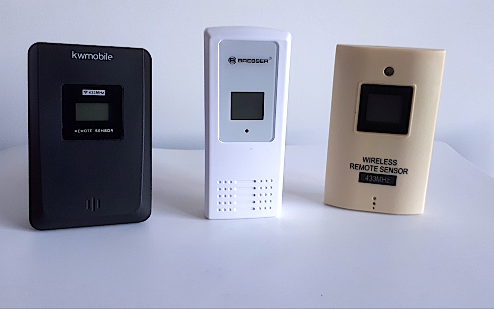

# Tasmota Nexus 433 MHz to MQTT Gateway for Home Assistant




This project describes a custom extension for [Tasmota](https://github.com/arendst/Tasmota) lite firmware to build a gateway capable of receiving 433 MHz wireless temperature-humidity sensor data and sending it over MQTT to integrate into popular Home Automation systems.

Flashed with this custom Tasmota firmware your ESP8266/ESP32 device obtain new functionality:
* Support of wireless temperature-humidity sensors
* Network connectivity over WiFi
* Web interface with Console
* MQTT support
* OTA firmware update
* Integration into Home Automation systems

This project uses the [Nexus_Decoder library](https://github.com/phpcoder/temperature-humidity-sensor-arduino) and requires an extra 433.92 MHz receiver connected to one of the ESP8266/ESP32 GPIO pin. The SRX882 superheterodyne receiver module is recommended to obtain a reliable signal with minimum noise from its DATA pin (pin #5).


## UPD Apr 2, 2024

The project sources are updated to Tasmota-13.4.0.

After few years of use of the 433 MHz wireless temperature-humidity sensors it was found that relatively cheap products similar to those shown above used as temperature/humidity monitors in Home Automation system present a number of challenges:
	* low accuracy and significant spread of absolute values between devices
	* max humidity is limited to 95% with bad accuracy towards the max value
	* short range and bad propagation through popular construction materials
	* low battery lifetime, and extra work with adjusting to new ID after battery change
	* low reliability of readout which, if used as a sensor in heating system, may be problematic.
To circumvent the latter problem an installation of a second sensor can help to improve reliability which makes the whole idea of 433 MHz wireless sensor network not so attractive.

### The way to go 

After some trials a better solution to build a temperature-humidity monitoring for Home Automation system was found. For mission critical temperature monitoring for domestic heating system I can recommend to move away from 433.92 MHz technology to Bluetooth 5.0. I have successfully deployed a network of BT5.0 Xiaomi Mijia LYWSD03MMC temperature sensors flashed with [custom firmware](https://github.com/pvvx/ATC_MiThermometer). The advantages found after about a year of use LYWSD03MMC devices:
	* high accuracy and stability: temp values are reported with 0.01 degree accuracy
	* longer (adjustable) range compared to 433.92 MHz sensors
	* humidity is accurately reported up to 98%
	* longer battery lifetime, about a year compared to 4-6 months of 433.92 MHz sensors
	* no need to change anything when replace batteries
	* native integration into Home Assistant
	* native support of BT5.0 by most popular hardware (RPi, NUC)
	* LYWSD03MMC can be even cheaper than available 433.92 MHz sensors
	* compact size


## Installation and Building the Tasmota Firmware

To start with, you need to install [PlatformIO](https://tasmota.github.io/docs/Compile-your-build/#compiling-tools) to your system and clone a Tasmota stable (preferred) branch. The process of making a [custom Tasmota build](https://tasmota.github.io/docs/Compile-your-build/#customize-your-build) is described here in detail with all required custom config files included into this repository:

* Copy provided [`/platformio_override.ini`](https://github.com/phpcoder/tasmota-nexus-mqtt/blob/main/platformio_override.ini) file to the cloned Tasmota project root folder
	- it is made for [Wemos D1 mini ESP8266 board](https://www.wemos.cc/en/latest/d1/d1_mini_3.1.0.html), for other boards uncomment your specific board type name in `env` section
	- set your system's serial port connected to your board as `upload_port` parameter used for flashing your board and later for monitoring the serial data
	- optionally set proper `upload_speed` (and optionally `monitor_speed`)
* Copy [`/tasmota/user_config_override.h`](https://github.com/phpcoder/tasmota-nexus-mqtt/blob/main/tasmota/user_config_override.h) to the `/tasmota` folder
	- enter your own WiFi/MQTT Broker **credentials**, MQTT Broker **host** and project **name**
* Copy [`/tasmota/xdrv_103_nexus_mqtt.ino`](https://github.com/phpcoder/tasmota-nexus-mqtt/blob/main/tasmota/xdrv_103_nexus_mqtt.ino) to the `/tasmota` folder
	- modify the MQTT topic as required for use with your preferred Home Automation System
	- check the GPIO pin number where your 433.92 MHz receiver module is connected

With all configuration in place, compile your custom Tasmota lite firmware with a command `pio run`. If compilation is error free, connect your board to the serial port and upload a compiled firmware as 

```
pio run --target upload && pio device monitor
```
This will result in a Tasmota lite firmware with Nexus to MQTT gateway flashed into your board. Provided with correct WiFi credentials your device can be found on your local area network. It can be accessed with the device IP and all settings can be done using handy and minimalistic Tasmota WEB UI. In the Console you can find messages sent by all compatible wireless temperature-humidity sensors located nearby. If your device cannot connect to your WiFi, it will show up as a WiFi hotspot and offer to reconfigure your WiFi settings.


## Home Assistant Integration

How to make your temperature-humidity sensor readings available in Home Assistant? It's easy as Tasmota firmware provides an automatic MQTT discovery for easy integration into Home Assistant. Full topic can be changed to `homeassistant/sensor` using WEB UI of the Tasmota device. If your MQTT Broker access credentials are set correct, normally your device can be found in the Home Assistant MQTT Integration's Device list. 

To be able to add your wireless temperature-humidity sensors as entities under your new auto-discovered MQTT device a few more steps are needed. For every sensor you need to issue two configuration MQTT messages with a retain flag, one for the temperature info and the other for humidity. You can use `mosquitto_pub` binary if it is available on your system; you only need to provide a proper name for your device with the `"name"` property, and put the actual ID number instead of `"IDxx"` in all occurences of the `"nexus_IDxx"` string. The ID of each sensor can be found in WEB UI Console.

```
mosquitto_pub -r -h 192.168.x.x -p 1883 -u username -P password -t "homeassistant/sensor/nexus_IDxx_temperature/config" \
  -m '{"uniq_id":"nexus_IDxx_temperature", "device_class": "temperature", "name": "Bedroom Temperature", "state_topic": "homeassistant/sensor/nexus_IDxx/state", "unit_of_measurement": "°C", "state_class": "measurement", "value_template": "{{value_json.temp}}", "device":{"identifiers":["Tasmota_NEXUS_MQTT_Gateway"], "manufacturer":"Tasmota", "model":"Generic", "name":"Tasmota Nexus MQTT Gateway"}}'

mosquitto_pub -r -h 192.168.x.x -p 1883 -u username -P password -t "homeassistant/sensor/nexus_IDxx_humidity/config" \
  -m '{"uniq_id":"nexus_IDxx_humidity", "device_class": "humidity", "name": "Bedroom Humidity", "state_topic": "homeassistant/sensor/nexus_IDxx/state", "unit_of_measurement": "°C", "state_class": "measurement", "value_template": "{{value_json.hum}}", "device":{"identifiers":["Tasmota_NEXUS_MQTT_Gateway"], "manufacturer":"Tasmota", "model":"Generic", "name":"Tasmota Nexus MQTT Gateway"}}'
```

Another way to register your wireless sensors in Home Assistant is to use the option `CONFIGURE` in Home Assistant's MQTT Integration menu. In this menu it is possible to publish a configuration message with a needed topic. Again the two messages are needed per each sensor.

To be able to register only needed wireless sensors I created a flow using Node-Red which can issue all configuration MQTT messages on one click. This allows to manually reconfigure all devices, even after replacing batteries and keep control of registered sensors. Here is my Node-Red flow:

```
[{"id":"c9f75bcae73bff7d","type":"tab","label":"Register MQTT Temperature Humidity Sensors","disabled":false,"info":"","env":[]},{"id":"81276b11327cb195","type":"mqtt out","z":"c9f75bcae73bff7d","name":"Publish MQTT","topic":"","qos":"","retain":"true","respTopic":"","contentType":"","userProps":"","correl":"","expiry":"","broker":"7719a266.59932c","x":620,"y":220,"wires":[]},{"id":"bf6521002d94dbd7","type":"function","z":"c9f75bcae73bff7d","name":"Register Sensors","func":"\nconst sensors = [\n    { name: 'Sensor 1',     id: '8E'},\n    { name: 'Sensor 1',     id: '62'},\n    { name: 'Sensor 1',     id: '76'},\n    { name: 'Sensor 1',     id: '59'},\n]\n\n\nconst format_discovery_temp_msg = (id, name) => {\n    return {\n        topic: 'homeassistant/sensor/nexus_'+id+'_temperature/config',\n        payload: {\n            uniq_id:'nexus_'+id+'_temperature',\n            device_class: 'temperature',\n            name: name,\n            state_topic: 'homeassistant/sensor/nexus_'+id+'/state',\n            unit_of_measurement: '°C',\n            state_class: \"measurement\", // needed to keep statistics\n            value_template: '{{value_json.temp}}',\n            device: {\n                identifiers: ['Tasmota_MQTT_Gateway'],\n                manufacturer: 'Tasmota',\n                model: 'Generic',\n                name: 'Tasmota MQTT Gateway'\n            }\n        }\n    }\n}\nconst format_discovery_hum_msg = (id, name) => {\n    return {\n        topic: 'homeassistant/sensor/nexus_'+id+'_humidity/config',\n        payload: {\n            uniq_id:'nexus_'+id+'_humidity',\n            device_class: 'humidity',\n            name: name,\n            state_topic: 'homeassistant/sensor/nexus_'+id+'/state',\n            unit_of_measurement: '%',\n            state_class: \"measurement\", // needed to keep statistics\n            value_template: '{{value_json.hum}}',\n            device: {\n                identifiers: ['Tasmota_MQTT_Gateway'],\n                manufacturer: 'Tasmota',\n                model: 'Generic',\n                name: 'Tasmota MQTT Gateway'\n            }\n        }\n    }\n}\n\nmsg = []\nfor (const s of sensors) {\n    msg.push(format_discovery_temp_msg(s.id, s.name+' Temperature'))\n    msg.push(format_discovery_hum_msg(s.id, s.name+' Humidity'))\n}\n\n\nreturn [msg];","outputs":1,"noerr":0,"initialize":"","finalize":"","libs":[],"x":390,"y":220,"wires":[["81276b11327cb195"]]},{"id":"eb4aa3713c53fcce","type":"inject","z":"c9f75bcae73bff7d","name":"Register","props":[{"p":"payload"},{"p":"topic","vt":"str"}],"repeat":"","crontab":"","once":false,"onceDelay":0.1,"topic":"","payloadType":"date","x":190,"y":220,"wires":[["bf6521002d94dbd7"]]},{"id":"7719a266.59932c","type":"mqtt-broker","name":"","broker":"localhost","port":"1883","clientid":"","autoConnect":true,"usetls":false,"protocolVersion":"4","keepalive":"60","cleansession":true,"birthTopic":"","birthQos":"0","birthPayload":"","birthMsg":{},"closeTopic":"","closeQos":"0","closePayload":"","closeMsg":{},"willTopic":"","willQos":"0","willPayload":"","willMsg":{},"sessionExpiry":""}]
```


## Conclusion and Outlook

How this project can be useful? Why another 433Mhz to MQTT gateway if such devices as RFXCOM [RFXtrx](http://www.rfxcom.com/epages/78165469.sf/en_GB) or Sonoff 433MHz [RFBridge](https://sonoff.tech/product/smart-home-security/rf-bridger2/) are available?

In my experience with using RFXtrx I encoutered a few problems:

* RFXtrx433XL supports plenty of protocols, most of which are not needed. Still some needed protocols are not supported.
* Official Firmware update and management software is available only under Windows. To update its firmware the RFXtrx433XL device should be disconnected from HA system.
* Serial USB connection with HA server and the length of external antenna cable limits the location of the whole HA system with 433 MHz signal coverage.
* RFXtrx433XL directly connected via USB to RPi draws too much current making system unstable. It requires an additional powered USB hub for stable operation. 
* The use of RFXtrx device requires an extra intregration to Home Assistant in addition to the existing MQTT integration.
* After all, the RFXtrx433XL is expensive and costs even more than RPi4.

I tried also Sonoff 433MHz RFBridge, a very useful hardware, however with serious limitations:

* It requires some hardware mods to work with custom firmware and extra protocols.
* It has a very limited list of supported protocols, e.g. wireless temperature-humidity sensors described in this project are not supported.
* It uses small internal antennas that limit the RF coverage.

Additionally, in both solutions I do not need a transmission capability, only receiving is required. 

Finally, there are projects offering similar functionality, most notably [OpenMQTTGateway](https://docs.openmqttgateway.com/). I found that OpenMQTTGateway used with Home Assistant attempts to register automatically all available devices it can ever recognize, including those belonging to the nearby households. When batteries in wireless temperature sensors are changed, they change their IDs to another random number, and the amount of automatically registered devices is growing exponentially.

The described project serves as another example of the [custom integration into Tasmota firmware](https://github.com/phpcoder/tasmota-custom-integration). For simplicity it describes only a single protocol gateway. I am planning to publish more examples of 433MHz to MQTT gateways with more supported protocols as used in my HA system.


## Links

* [Tasmota](https://github.com/arendst/Tasmota) - Alternative firmware for ESP8266 and ESP32 based devices.
* [PlatformIO](https://platformio.org/) - Professional collaborative platform for embedded development.
* [Wemos D1 mini](https://www.wemos.cc/en/latest/d1/d1_mini_3.1.0.html) - A mini wifi board with 4MB flash based on ESP-8266EX.
* [SONOFF RFBridge](https://sonoff.tech/product/smart-home-security/rf-bridger2/).
* [RFXtrx433XL](http://www.rfxcom.com/epages/78165469.sf/en_GB) - USB HA controller.
* [OpenMQTTGateway](https://github.com/1technophile/OpenMQTTGateway).
